# Codeless Orchestrator — Design Overview (Confluence)

This document explains the design of the Codeless Orchestration application: its goals, architecture, data model, execution flow, and extension points. It links to deeper Markdown docs in the repository and includes placeholders for recommended diagrams to add in Confluence.

- Repository overview: see README (docs and quickstart)
  - README: docs link → [README.md](../README.md)
  - Architecture: [docs/architecture.md](architecture.md)
  - Orchestrations: [docs/orchestrations.md](orchestrations.md)
  - Providers: [docs/providers.md](providers.md)
  - Tools: [docs/tools.md](tools.md)
  - Context: [docs/context.md](context.md)
  - Structured output: [docs/structured-output.md](structured-output.md)
  - Safety: [docs/safety.md](safety.md)
  - Server: [docs/server.md](server.md)
  - Telemetry: [docs/telemetry.md](telemetry.md)
  - Config schema: [docs/config-schema.md](config-schema.md)
  - Operations: [docs/operations.md](operations.md)
  - Examples: [docs/examples.md](examples.md)
  - Installation notes: [WEBSEARCH_OPTIONAL.md](../WEBSEARCH_OPTIONAL.md)
  - Tool call fix note: [TOOL_CALL_FIX.md](../TOOL_CALL_FIX.md)
  - Decisions (ADRs): [docs/decisions](decisions/)

### Codeless Orchestrator System Overview

```mermaid
flowchart LR
  %% Title: Codeless Orchestrator System Overview

  %% Components
  C[Client]

  subgraph S[FastAPI Server]
    API[/Compile / Validate / Execute/]
  end

  subgraph E[Orchestration Engine (LangGraph)]
    ENG[Executor / Turn Loop]
    REG[Tool Registry]
  end

  subgraph P[Providers]
    P1[OpenAI Adapter]
    P2[Gemini Adapter]
  end

  subgraph T[Tools]
    W[Web Search]
  end

  TELEM[(Telemetry Sink)]

  %% External services
  OA[(OpenAI API)]
  GA[(Google Generative AI)]
  DDG[(DuckDuckGo Search) ]

  %% Data flows
  C -->|Request| API
  API -->|Response| C
  API -->|SSE stream| C

  API -->|execute| ENG
  ENG -->|provider call| P1
  ENG -->|provider call| P2
  P1 -->|HTTPS| OA
  P2 -->|HTTPS| GA

  ENG -->|tool invocation| REG
  REG -->|dispatch| W
  W -->|HTTP| DDG

  API -.->|Metrics| TELEM
  ENG -.->|Metrics| TELEM
  P1 -.->|Metrics| TELEM
  P2 -.->|Metrics| TELEM
  W -.->|Metrics| TELEM
```

## Purpose & Goals

- Provide a codeless, declarative way to define agentic workflows (graphs) and execute them reliably.
- Offer a provider-agnostic interface for LLM chat, tools/function-calling, streaming, structured output, and safety.
- Enable observability (metrics/telemetry), strong validation, and predictable behavior for production usage.

## System Context

- Clients: HTTP callers (apps, services) integrate via the FastAPI server endpoints.
- Server: Exposes compile/validate/execute routes with optional SSE streaming for tokens and events.
- Engine: Compiles and runs agent graphs on LangGraph with deterministic tool loops.
- Providers: OpenAI and Gemini adapters map a unified chat interface to specific APIs.
- Tools: Built-in and custom tools surfaced as function-calling specs to models.
- Telemetry: In-memory counters/timers; optional OTLP export (see Telemetry doc).

### System Context Diagram

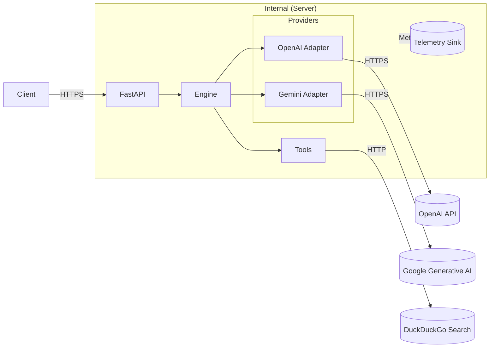

## Architecture Overview

See: [docs/architecture.md](architecture.md)

- Compiler: Validates and compiles declarative graphs (YAML/JSON) into executable artifacts for LangGraph.
- Engine: Orchestrates turns, maintains state, handles streaming, and executes tools in a controlled loop.
- Providers: Pluggable adapters (`openai`, `gemini`) for chat, tools, and streams with unified types.
- Tools: Registry-driven discovery and execution, with JSON Schema parameters and timeouts.
- Runtime Pipelines: Context assembly, structured-output enforcement, and safety filtering/redaction.
- Server: FastAPI endpoints for compile/validate/execute (stream and non-stream).
- Telemetry: Timers and counters per run/turn/tool; optional OTLP export.

### Architecture Components

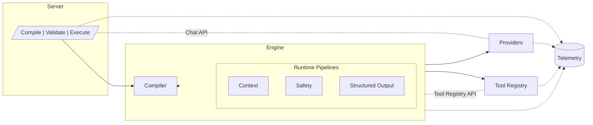

## Core Data Model

Reference: [docs/providers.md](providers.md)

- ChatMessage: `role (system|user|assistant|tool)`, `content`, optionally `tool_call_id` or `tool_calls`.
- ToolSpec: `{name, description?, parameters(JSON Schema)}`.
- ToolCall: `{id, name, arguments_json}` assembled from streaming or full responses.
- ChatRequest: `{model, messages, tools?, tool_choice, temperature, top_p, max_tokens, stop, seed, json_mode_enabled, response_format_schema?, metadata, timeout}`.
- ChatResponse: `{message, finish_reason, usage, raw}`.
- Streaming deltas (`ChatChunk`): types include `role`, `content.delta`, `tool_call.start`, `tool_call.delta`, `tool_call.end`, `message.end`.

[Create a data model diagram with the following details:
- Entities: ChatMessage, ToolSpec, ToolCall, ChatRequest, ChatResponse, ChatChunk
- Relationships: Assistant message → ToolCalls; Tool message references ToolCall via `tool_call_id`]

### Core Data Model

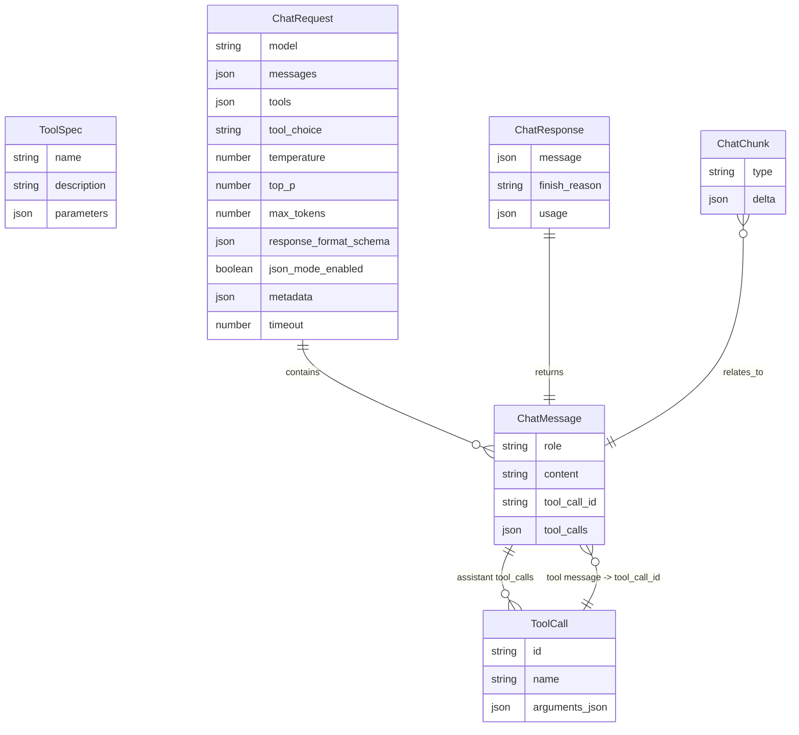

## Execution Lifecycle

High level path from request to response.

1) Compile
- Parse and validate the orchestration config (YAML/JSON) into an internal graph.
- Identify orchestration mode (sequential, handoff, concurrent, group chat) and build the LangGraph app.

2) Execute Turn
- Build the per-agent context (history window, system preamble, style guide) → [docs/context.md](context.md)
- Apply Safety Pre-Filters (PII redaction, injection defense) → [docs/safety.md](safety.md)
- Invoke provider adapter (OpenAI/Gemini) with normalized params and tools.
- Stream deltas or wait for the final message.
- If assistant emits tool calls, enter deterministic tool loop.
- Execute tools with timeouts; append tool results as `tool` messages referencing prior tool_call IDs.
- Continue the agent turn until model stops with no further tool calls.
- Apply post-filter/redaction and structured-output handling as configured → [docs/structured-output.md](structured-output.md)

3) Emit Result
- Return final assistant message and optional metrics.
- For streams, emit SSE events (token/text deltas, tool calls, message end) → [docs/server.md](server.md)

[Create a sequence diagram with the following details:
- Title: "Execute Turn with Tools and Streaming"
- Lifelines: Client, Server (FastAPI), Engine, Provider, Tool Registry, Tool Impl
- Steps: compile → context → provider call (stream) → tool_call start/delta/end → tool execution → tool result message → provider follow-up → final message → SSE end]

### Execute Turn with Tools and Streaming

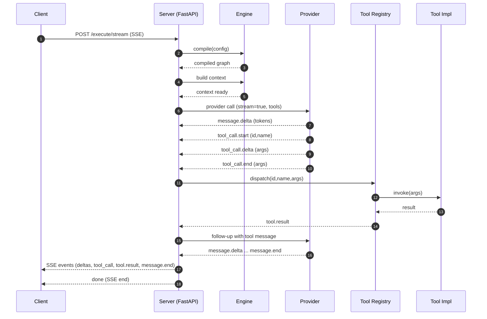

## Orchestration Modes & Builders

Reference: [docs/orchestrations.md](orchestrations.md)

- Sequential: Single path covering all agents.
- Handoff: Router selects next agent among candidates.
- Concurrent: Fan-out/fan-in with merge strategies.
- Group Chat: SCC with ≥2 agents; round-robin or moderator policy using a router.

[Create a flow diagram with the following details:
- Title: "Mode Detection"
- Input: Agent-only graph
- Decision logic: sequential vs handoff vs concurrent vs group chat
- Output: Selected builder and constructed LangGraph app]

### Mode Detection

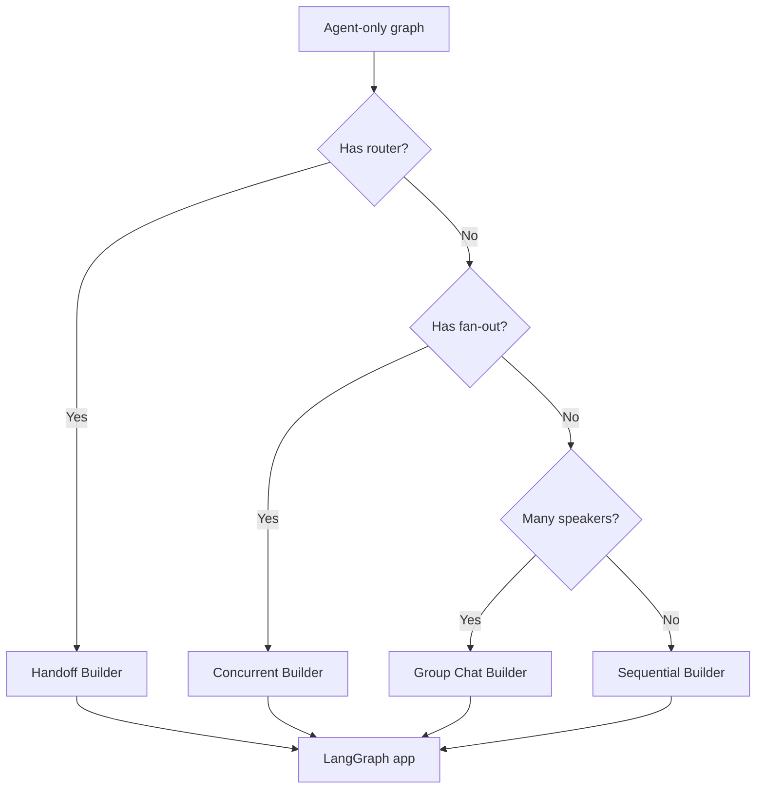

## Prompt & Context Pipeline

Reference: [docs/context.md](context.md)

- Single system message built from org preamble + system instructions + style guide.
- History window trims transcript per agent policy.
- Variables interpolation (simple substitution) into templates → [docs/templates in runtime](context.md)

[Create a diagram with the following details:
- Title: "Context Assembly"
- Inputs: Org preamble, agent system instructions, style guide, history messages, vars
- Output: Final prompt parts and normalized request]

### Context Assembly

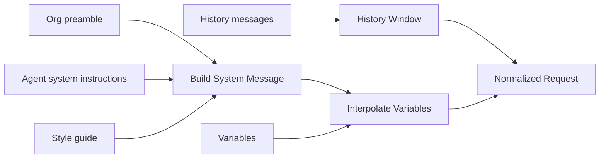

## Tools & Function Calling

Reference: [docs/tools.md](tools.md)

- Registry-based discovery; tools have name, description, JSON Schema parameters, and an `invoke(args)`.
- Exposed to providers as OpenAI-compatible function tools.
- Deterministic tool loop executes tools after an assistant emits tool calls; results added as `tool` messages with `tool_call_id` linkage.
- Built-in Web Search uses DuckDuckGo (`ddgs`) and is optional → [WEBSEARCH_OPTIONAL.md](../WEBSEARCH_OPTIONAL.md)
- Tool call ID linking/bug fix context → [TOOL_CALL_FIX.md](../TOOL_CALL_FIX.md)

[Create a flow diagram with the following details:
- Title: "Tool Loop"
- Inputs: Assistant message with tool_calls[]
- Steps: validate args → dispatch to tool → timeout handling → capture result → append tool message with tool_call_id → continue turn]

### Tool Loop

```mermaid
flowchart LR
  I[Assistant message with tool_calls[]] --> V[Validate args]
  V --> D[Dispatch to tool]
  D --> T{Timeout?}
  T -- Yes --> F[Fail/timeout handling]
  F --> C[Append tool message (error) with tool_call_id]
  T -- No --> X[Execute Tool]
  X --> R[Capture result]
  R --> C[Append tool message with tool_call_id]
  C --> N[Continue turn]
```

## Providers and Transforms

Reference: [docs/providers.md](providers.md), decisions: [0002 OpenAI](decisions/0002-openai-provider.md), [0003 Gemini](decisions/0003-gemini-adapter.md)

- OpenAI: Maps unified types to Chat Completions API; supports streaming deltas (role/content/tool_calls/message.end), JSON-mode, usage mapping.
- Gemini: Aggregates system instruction, maps tools to `function_declarations`, and tool results to `function_response` with name resolved from tool_call linkage.
- Error/finish reason mapping, usage tokens best-effort per provider.

[Create a mapping diagram with the following details:
- Title: "Provider Transforms"
- Left: Unified types; Right: OpenAI and Gemini payloads
- Include role/content mapping, tool_calls/function_call mapping, usage]

### Provider Transforms

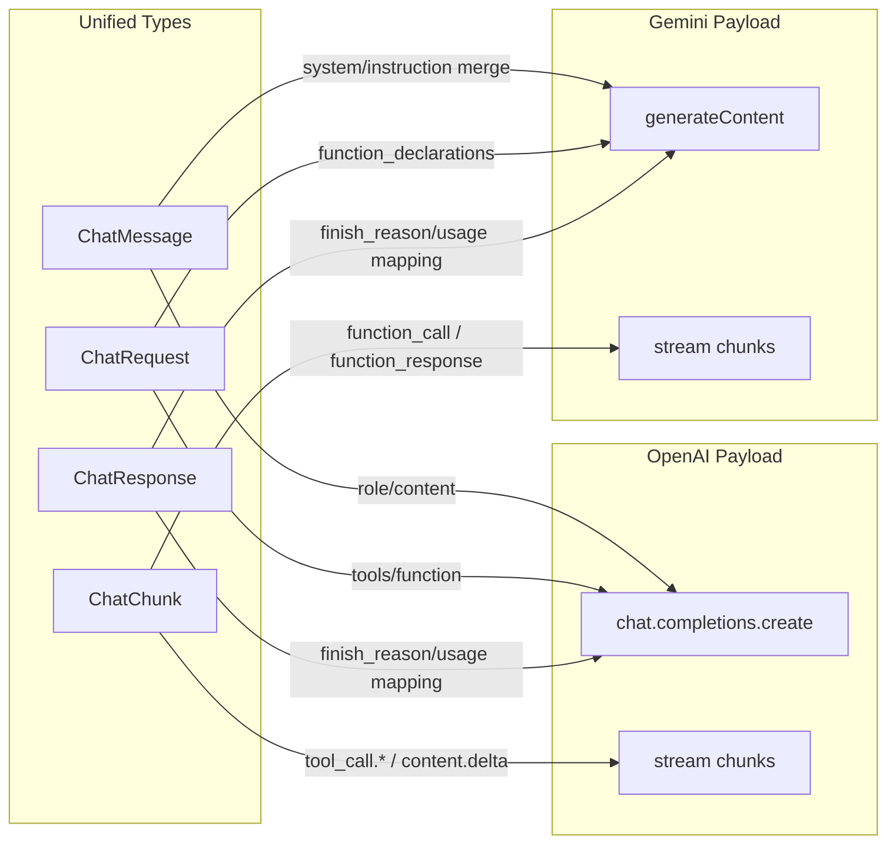

## Structured Output

Reference: [docs/structured-output.md](structured-output.md)

- When enabled per agent: enforce JSON-only outputs, pass schema to provider when supported.
- Parse/validate; on violation, repair and retry up to `maxRepairAttempts`.
- Provide compact JSON in final assistant message content.

[Create a loop diagram with the following details:
- Title: "Structured Output Repair Loop"
- Steps: request with JSON mode → parse → validate → if invalid, repair instruction → retry (bounded) → success → output JSON]

### Structured Output Repair Loop

```mermaid
flowchart LR
  A[Request with JSON mode + schema] --> B[Provider response]
  B --> C{Valid JSON per schema?}
  C -- Yes --> D[Output JSON]
  C -- No --> E[Repair instruction]
  E --> F[Retry (bounded)]
  F --> B
```

## Safety & Security

Reference: [docs/safety.md](safety.md), decision: [0004 Safety Policy](decisions/0004-safety-policy.md)

- Pre-filter: Apply safety policy per agent (prompt injection defense, PII redaction, onBlock behavior).
- Post-filter: Redact assistant content before appending to transcript.
- Injection scoring and refusal/warn policies.

[Create a security flow diagram with the following details:
- Title: "Safety Pipeline"
- Stages: Pre-filter (PII, injection scoring) → Provider call → Post-filter (redaction) → Emission]

### Safety Pipeline

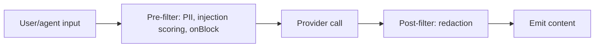

## Observability & Telemetry

Reference: [docs/telemetry.md](telemetry.md)

- Per-run timers around compile and execute; per-turn/tool metrics.
- SSE events include `request_id` and (optionally) metrics at `message.end`.
- Optional OpenTelemetry export via extras.

[Create a diagram with the following details:
- Title: "Telemetry & Streaming"
- Show timers (compile/execute), labels, and SSE events including metrics on message.end]

### Telemetry & Streaming

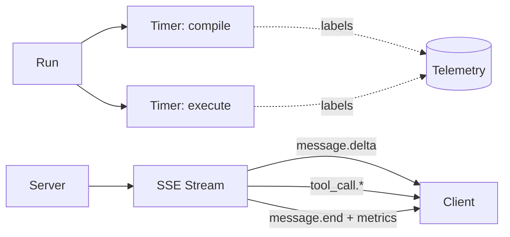

## Configuration & Settings

Reference: [docs/config-schema.md](config-schema.md)

- Declarative graph config: agents, tools, connections, policies, and runtime options.
- Environment: API keys and provider settings via environment variables.
- Telemetry labels/emit toggles configurable via agent telemetry config.

[Create a diagram with the following details:
- Title: "Configuration Surfaces"
- Inputs: YAML/JSON graph, environment variables
- Outputs: Engine compile parameters, provider credentials, telemetry settings]

### Configuration Surfaces

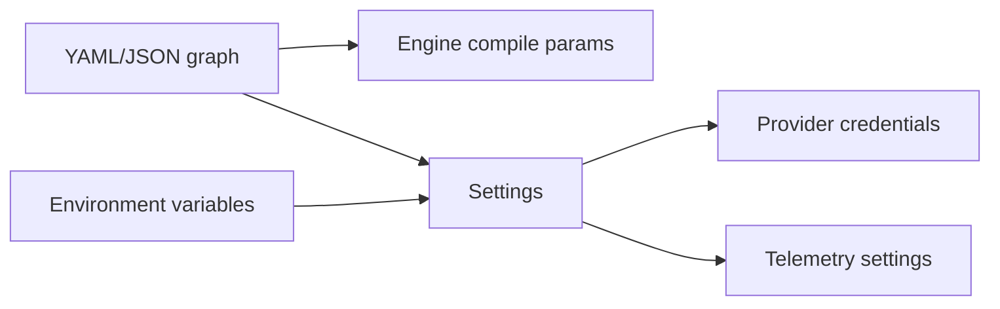

## Server API

Reference: [docs/server.md](server.md)

- Endpoints:
  - POST `/compile`: Validate and compile without executing.
  - POST `/validate`: Validate config schema and references.
  - POST `/execute`: Execute non-streaming, return final message and metrics.
  - POST `/execute/stream`: SSE with deltas and metrics on `message.end`.
- Request/response models mirror unified provider types (see Providers doc).

[Create a sequence diagram with the following details:
- Title: "SSE Streaming Contract"
- Events: role, content.delta, tool_call.start/delta/end, message.end, error, end
- Include headers: `X-Request-ID`, timestamps, metrics on message.end]

### SSE Streaming Contract

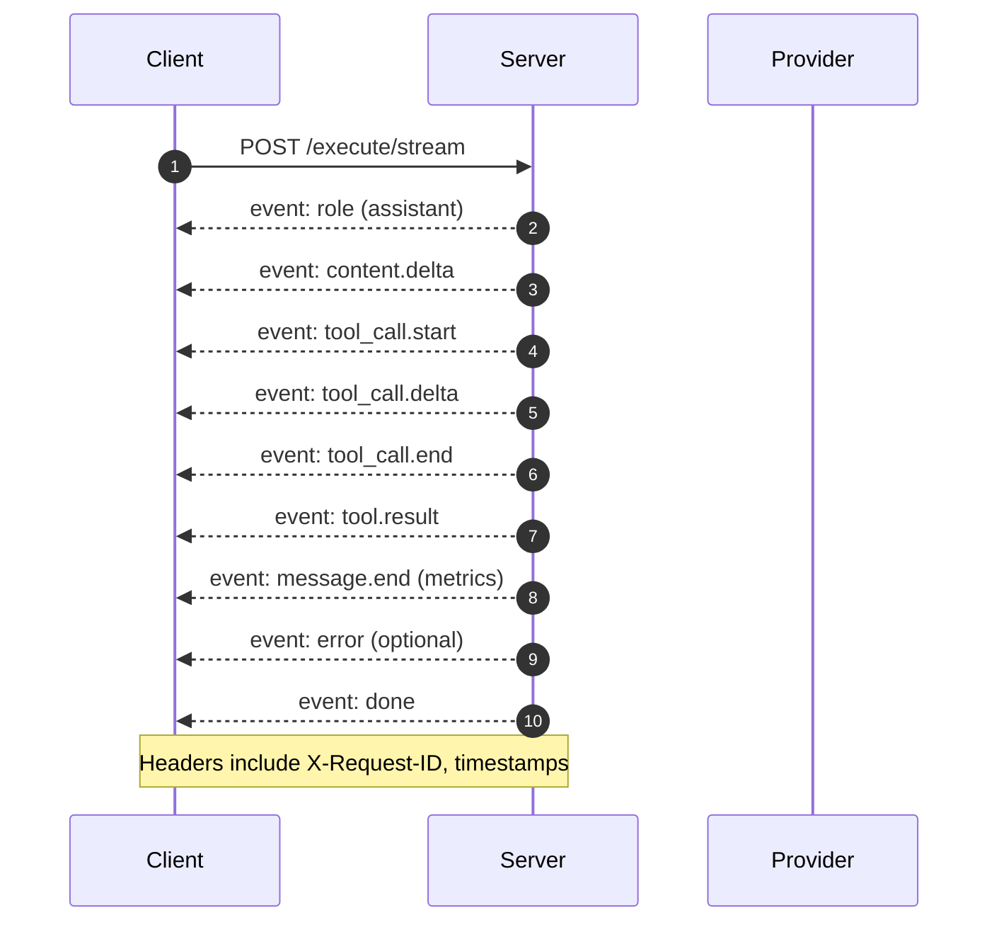

## Extensibility

- Providers: Implement the provider base interface and mapping; add to resolver.
- Tools: Add new tool implementations, register in the Tool Registry with JSON Schema parameters.
- Builders: Extend orchestration builders for new graph patterns.
- Policies: Add context/safety/prompt policies under runtime packages.

[Create a component diagram with the following details:
- Title: "Extension Points"
- Nodes: Provider adapter, Tool (BaseTool), Graph Builder, Policy
- Arrows: Integration points with Engine and Server]

### Extension Points

```mermaid
flowchart LR
  Engine[Engine]
  Server[Server]
  Prov[Provider Adapter]
  Tool[Tool (BaseTool)]
  Builder[Graph Builder]
  Policy[Policy]

  Prov --> Engine
  Tool --> Engine
  Builder --> Engine
  Policy --> Engine
  Server --> Engine
  Prov -. register .-> Server
  Tool -. register .-> Server
```

## Deployment & Operations

References:
- [docs/deployment.md](deployment.md)
- [docs/operations.md](operations.md)
- Dockerfile and container guidance in repo root

- Runs as a FastAPI app (Uvicorn). Enable SSE and OTLP extras as needed.
- Scale horizontally; state is per-request (no shared mutable state unless persistence hooks are enabled).
- Health checks and metrics endpoints configurable via deployment doc.

[Create a deployment diagram with the following details:
- Title: "Deployment Topology"
- Nodes: Client(s), API Gateway (optional), FastAPI pods, Provider endpoints, Telemetry backend
- Ports and protocols: HTTPS, SSE]

### Deployment Topology

```mermaid
flowchart LR
  Clients[Client(s)] -->|HTTPS| Gateway[(API Gateway)]
  Gateway -->|HTTPS| Pods[[FastAPI Pods]]
  Pods -->|HTTPS| Providers[(Provider Endpoints)]
  Pods -.-> Telemetry[(Telemetry Backend)]
  Clients <-- SSE --> Pods
```

## Trade-offs & Decisions (ADRs)

See: [docs/decisions](decisions/) for recorded design decisions:
- [0001 Packaging](decisions/0001-packaging.md)
- [0002 OpenAI Provider](decisions/0002-openai-provider.md)
- [0003 Gemini Adapter](decisions/0003-gemini-adapter.md)
- [0004 Safety Policy](decisions/0004-safety-policy.md)

## Testing Strategy

- Unit and end-to-end tests exercise provider adapters, tool loops, streaming SSE order, orchestrations, safety, and structured output.
- Deterministic stubs validate behavior across modes (sequential, handoff, concurrent, group chat).
- See `tests/` and [docs/examples.md](examples.md) for runnable examples.

[Create a coverage map diagram with the following details:
- Title: "E2E Coverage by Feature"
- Axes: Orchestrations × Capabilities (tools, streaming, structured output, safety, telemetry)]

### E2E Coverage by Feature

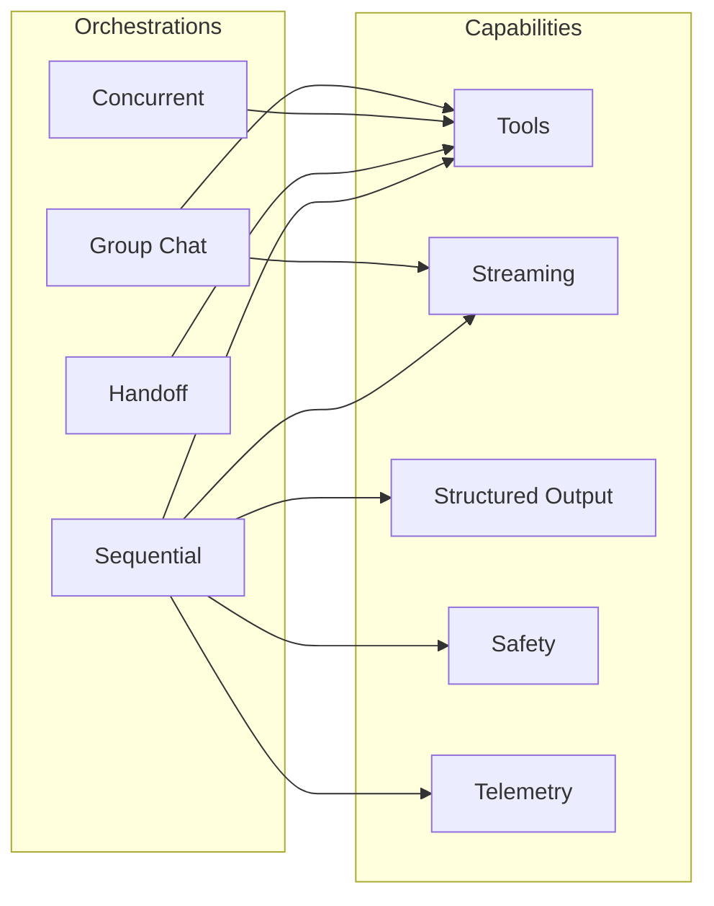

## Optional Features and Installation

See: [WEBSEARCH_OPTIONAL.md](../WEBSEARCH_OPTIONAL.md)

- Web Search and high-performance JSON are optional extras to avoid Rust/Cargo on restricted environments.
- Extras:
  - `websearch` (DuckDuckGo Search via `ddgs`)
  - `json` (orjson)
  - `sse` (sse-starlette)
  - `otel` (OpenTelemetry)

### Planned Enhancements

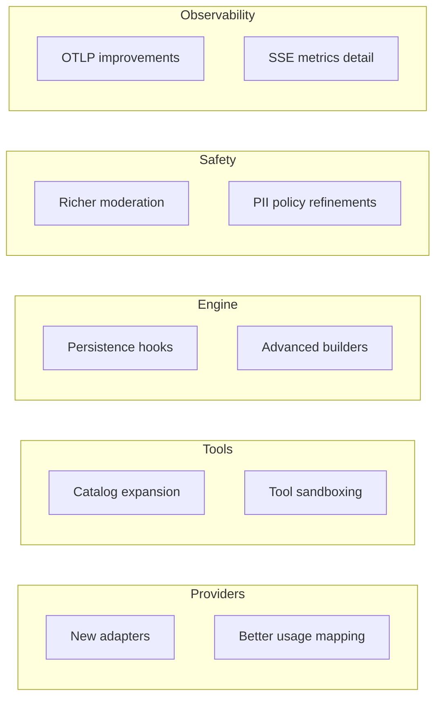

## Future Work

- Response schema integration for providers that support it natively.
- Persistence integrations for stateful orchestrations.
- Additional providers and tool catalogs.
- Richer moderation and safety policies.

[Create a roadmap diagram with the following details:
- Title: "Planned Enhancements"
- Swimlanes: Providers, Tools, Engine, Safety, Observability]
